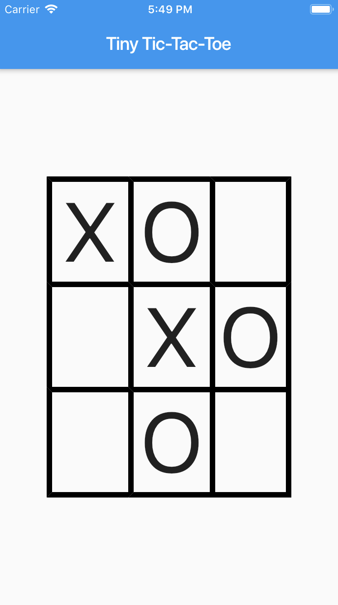
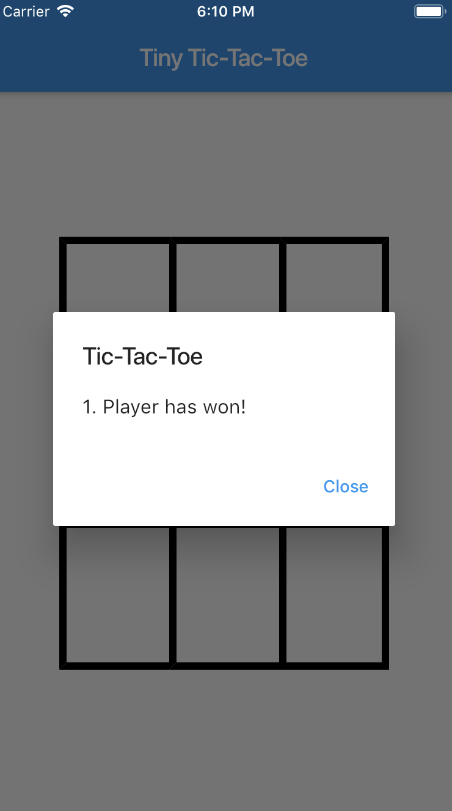

# Tic-Tac-Toe

In dieser Fallstudie erstellen Sie für das Spiel „Tic-Tac-Toe“ eine Flutter-App. Auch wenn vielen von Ihnen das Spielprinzip von Tic-Tac-Toe bereits bekannt sein dürfte, erläutern wir zunächst kurz das Spielprinzip.

## Beschreibung des Spiels

Zwei Spieler treten gegeneinander an. Das Spielbrett ist in eine Matrix von drei mal drei Feldern aufgeteilt. Pro Spielzug besetzt ein Spieler ein Feld auf dem Spielbrett, das zu Anfangs neun leere Felder aufweist. Der Stein des ersten Spielers sieht wie ein großes „X“ aus, der des zweiten wie ein großes „O“.

Die Spieler sind abwechselnd an der Reihe. Sobald es einem Spieler gelungen ist, drei Felder waagerecht, senkrecht oder diagonal zu besetzen, hat dieser das Spiel gewonnen. Es ist nach 9 Zügen auch möglich, dass kein Spieler gewonnen hat, das Spiel endet dann Unentschieden.

## Oberfläche der App

Die Oberfläche der App sollte in etwa so aussehen:


Abbildung 1: Oberfläche der Tic-Tac-Toe App.

## Setzen eines Spielsteins

Beim einer Touch-Geste ("Ein-Finger-Tipp") in das Spielfeld werden ``onTap``-Ereignisse ausgelöst,
die von einem ``GestureDetector``-Objekt aufgefangen werden können. Wenn Sie die ``onTap``-Ereignisse korrekt einem Element des 3x3-Spielfelds zuordnen, ist ein Stein auf dem Spielfeld zu setzen. Positionieren Sie abwechselnd „X“- und „O“-Steine pro Touch-Geste auf dem Spielfeld.


## Integration der Spiellogik
Im letzten Teilschritt der Aufgabe ist die Logik des Spiels in Ihre Flutter-App zu integrieren. Neben der bisher erstellten Oberfläche ergänzen Sie am besten eine Instanzvariable des Typs

``List<List<BoardState>> _board;``

mit dem Aufzählungsvariablentyp

``enum BoardState { Empty, Circle, Cross }``

und legen im Konstruktor das Feld durch die Anweisung

```javascript
_board = [
  [BoardState.Empty, BoardState.Empty, BoardState.Empty],
  [BoardState.Empty, BoardState.Empty, BoardState.Empty],
  [BoardState.Empty, BoardState.Empty, BoardState.Empty]
];
```

an. Pro Spielzug protokollieren Sie in dem ``_board``-Feld mit, an welcher Stelle welcher Stein gesetzt wurde. So können Sie Spielzug für Spielzug dann entscheiden, ob bereits drei Steine in einer Reihe vorliegen.

Es ist in einer Flutter-App auch möglich, eine Art „MessageBox“ aufzublenden, in Flutter spricht man von einem ``AlertDialog``. Dies können Sie entweder zu Testzwecken oder etwa am Ende des Spiels verwenden.

**Beispiel**:

Ein Aufruf der selbstgeschriebenen Methode ``_showDialog`` mit dem Aktualparameter '1. Player has won!':

```javascript
// dialog helper method
void _showDialog(String msg) {
  showDialog(
      context: context,
      builder: (BuildContext context) {
        return AlertDialog(
            title: new Text("Tic-Tac-Toe"),
            content: new Text(msg),
            actions: <Widget>[
              new FlatButton(
                child: new Text("Close"),
                onPressed: () {
                  Navigator.of(context).pop();
                },
              ),
            ]);
      });
}
```

Die Oberfläche der App sieht dann so aus:


Abbildung 2: Oberfläche der Tic-Tac-Toe App.
